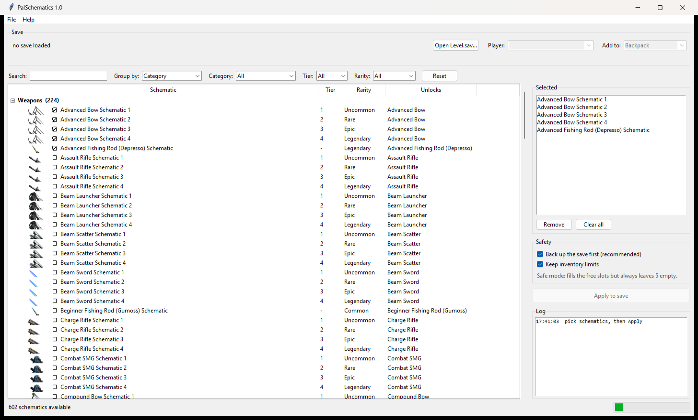

# PalSchematics

Add **Palworld schematics** to a save file — single player or dedicated server.
All 600-odd schematics, grouped by category, tier, rarity and workbench, with
the game's own icons so you can find what you want at a glance.

PalSchematics is original software. Save parsing uses the community
`palworld-save-tools` library (MIT); schematic data comes from
[paldb.cc](https://paldb.cc/en/Schematic).



---

## What it does

Schematics in Palworld are ordinary inventory items. While one sits in your
backpack it unlocks the matching recipe at the workbench — it is not consumed,
and it can be dropped or handed to another player. PalSchematics simply puts
the item into a player's backpack in the save file.

- **Every schematic** paldb lists — weapons, armor, accessories, structures,
  pal gear, raid slabs.
- **Grouped how you think about them** — by category, by category and type, by
  tier (Schematic 1–4), by rarity, by workbench, or by item so all four tiers of
  one weapon sit together.
- **Search** across schematic names, the item they unlock, and internal codes.
- **Icons** for every entry.
- **Dedicated servers supported** — the app reads every player in the world and
  lets you pick one by name.
- Double-click any entry to open its paldb page.

## How to run

1. **Close Palworld, or stop your dedicated server.** A running server holds the
   world in memory and overwrites the file on its next autosave — your edit
   would vanish. PalSchematics refuses to write if it sees the file change
   underneath it, but it cannot stop a server that starts saving afterwards.
2. Double-click `Run PalSchematics.bat` (needs Python 3.10+; it sets up its own
   environment on first run).
3. **File ▸ Open Level.sav**
   - Single player: `%LOCALAPPDATA%\Pal\Saved\SaveGames\<id>\<world>\Level.sav`
   - Dedicated server: `Pal\Saved\SaveGames\0\<world>\Level.sav`

   The `Players` folder must sit next to `Level.sav` — that is where each
   player's inventory is located.
4. Pick the player, tick what you want, press **Apply to save**.

### oo2core_9_win64.dll

Palworld 1.0 saves are Oodle-compressed, so unpacking one needs the game's own
runtime. Copy `oo2core_9_win64.dll` from your Palworld install
(`Steam\steamapps\common\Palworld\Pal\Binaries\Win64\`) into this folder. It is
not distributed here.

## Safety

Editing a save is editing a save, but this tool is built to fail safely rather
than quietly.

- **Round-trip check.** Before anything is modified, the save is decoded and
  re-encoded and the result must match the original *byte for byte*. If this
  build cannot represent your save losslessly, it refuses to write at all.
- **Written in the same format it arrived in.** A 1.0 server save goes back as
  Oodle/`PlM`, not re-packed as zlib.
- **Verify before swap.** The new save is written to a temporary file, re-opened
  from disk, and checked for the items you asked for. Only then is it swapped
  in, with an atomic replace. A failure at any stage leaves the original
  untouched.
- **File-changed detection.** If `Level.sav` changes on disk between opening and
  applying — the signature of a server still running — the write is refused.
- **Backups, on by default.** A timestamped `.bak` is written next to the save.
  To roll back: stop the server, copy the `.bak` over `Level.sav`.

### Inventory limits

The app reads how many slots the selected player actually has free and shows it
under the save path:

> `Psyonicar's backpack: 35 of 51 slots used - 16 free - room for 11 schematic(s) this apply`

By default it will fill those free slots but **always leave 5 empty**. A
completely full Palworld inventory is where odd things happen — pickups landing
on the ground, items seeming to vanish — so the bag is never filled to the brim.
Anything that does not fit is reported, not silently dropped; make room in-game
and apply again.

Switch the limits off in the Safety box and every free slot is fair game. Even
then the container's real capacity is a hard bound: the app will never write a
slot index the container does not have.

## Building from source

See [BUILDING.md](BUILDING.md) for the full instructions, including a
one-directory build if a scanner objects to the single-file one.

## Building the .exe

```
.venv\Scripts\pip install pyinstaller
.venv\Scripts\pyinstaller PalSchematics.spec
```

`dist\PalSchematics.exe` is a single ~12 MB file that needs no Python. Ship it
with a note telling people to drop `oo2core_9_win64.dll` next to it — that file
is Palworld's, so it is deliberately not bundled.

> Some antivirus tools flag *any* PyInstaller executable purely because of how
> it is packed. If that happens, the source version runs the same program.

## Updating the catalog

When Palworld adds schematics:

```
pip install pillow
python tools/build_data.py
```

This rescrapes paldb, refreshes `palschematics/data/schematics.json` and pulls
any missing icons. paldb's CDN rate-limits bulk downloads, so the icon step is
deliberately slow and can be re-run — it keeps what it already has.

## Checking it against your own save

```
python tools/selftest.py "C:\path\to\a COPY of Level.sav"
```

It exercises the catalog, the round-trip guarantee, the safety policy and the
write path, then proves that removing the added items reproduces the original
file byte for byte. **It writes to the file you give it — use a copy.**

## License

MIT — see [`LICENSE`](LICENSE). Palworld is © Pocketpair, Inc. This project is
not affiliated with Pocketpair or with paldb.cc.
